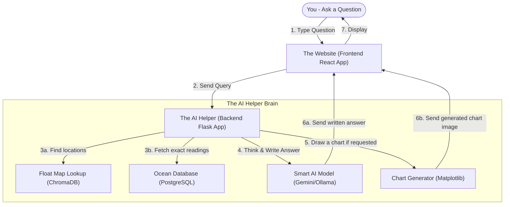

# 🌊 OceanIQ: Your Simple AI Guide to Ocean Data

Welcome to **OceanIQ**, a personal project designed to make complex ocean data easy to explore for everyone! 

Oceans are monitored by hundreds of floating scientific devices (called **ARGO floats**) that drift in the water, measuring things like temperature, saltiness (salinity), water pressure, and oxygen levels. While scientists use complex databases to read this data, **OceanIQ** lets anyone explore this information by simply chatting with an friendly AI ocean expert named **Aqua**.

If you want to know about ocean trends, see water maps, or generate custom charts, you can just ask in plain English!

---

## 🗺️ How it Works (In Simple Terms)

Here is a straightforward picture of how the website answers your questions:



---

## 🌟 What Can You Do With OceanIQ?

1. **Chat with an AI Oceanographer**: Ask standard questions about oceans (e.g., *"How many floats are active?"* or *"What is the temperature of the water?"*) and get clean, conversational answers.
2. **AI "Deep Thinking" Mode**: Switch on the **Thinking Mode** to let the AI do rigorous scientific reasoning, looking over years of history and thousands of database readings to give you a deep analysis.
3. **Instant Visual Charts**: If you include words like **plot**, **graph**, or **chart** in your question, the app automatically pulls the database records and draws a beautiful, easy-to-read chart for you.
4. **Interactive Dashboard**: A gorgeous welcome screen with charts and summaries showing how climate change impacts our oceans, marine biodiversity statistics, and simple guides.

---

## 🛠️ The Tech Behind the Project

Even though it's simple to use, OceanIQ is powered by modern tools:
* **The Look & Feel (Frontend)**: Built using **React** and **Vite** with **Tailwind CSS** for a fast, responsive, and modern look.
* **The Intelligence (Backend)**: Built using **Python** and **Flask**.
* **The Memory & Files (Database)**: Powered by **PostgreSQL** (to store all raw float readings) and **ChromaDB** (to match geographical names to physical floats).
* **The AI Brain**: Utilizes **Google Gemini API** (using `gemini-1.5-flash` for high-precision analytical thinking) and **Ollama** (for local AI backup).

---

## 🚀 Easy Onboarding Guide (Run it on your computer)

Follow these simple steps to start the application:

### Step 1: Open the Backend (The Brain)
1. Open your terminal in the `backend` folder.
2. Create and start a Python environment:
   ```bash
   python -m venv venv
   # Start the environment (Windows):
   .\venv\Scripts\Activate.ps1
   ```
3. Install the required Python packages:
   ```bash
   pip install flask flask-cors psycopg2-binary pandas numpy chromadb sentence-transformers google-generativeai matplotlib rich requests openpyxl huggingface-hub
   ```
4. Run the helper tool to download the matching local translation model:
   ```bash
   python download_model.py
   ```
5. Start the backend server:
   ```bash
   python server.py
   ```

### Step 2: Open the Frontend (The Interface)
1. Open a new terminal in the `frontend` folder.
2. Install the website requirements:
   ```bash
   npm install
   ```
3. Start the website:
   ```bash
   npm run dev
   ```
4. Click the link shown in your terminal (usually [http://localhost:5173](http://localhost:5173)) to open the website in your browser!

---

*This is a single-developer personal project created to democratize ocean science and climate awareness.*
