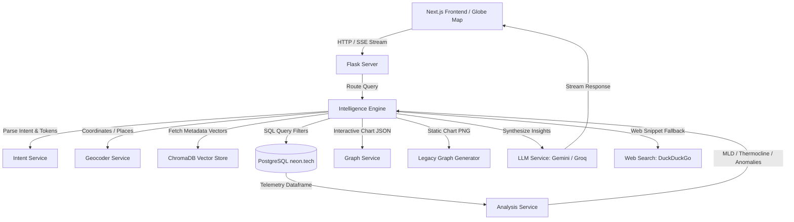

# 🌊 OceanIQ: AI-Powered Oceanographic Data Analytics & RAG Dashboard

[](https://www.python.org/)
[](https://flask.palletsprojects.com/)
[](https://nextjs.org/)
[](https://react.dev/)
[](https://www.trychroma.com/)
[-blue?logo=postgresql&logoColor=white)](https://neon.tech/)
[](https://tailwindcss.com/)
[](https://opensource.org/licenses/MIT)

OceanIQ is an advanced, production-ready oceanographic analysis platform that empowers researchers to query, analyze, and visualize **ARGO float** profile telemetry using natural language. By coupling a hybrid RAG (Retrieval-Augmented Generation) intelligence engine with direct edge data analytics, OceanIQ makes high-density spatial ocean data instantly accessible.

---

## 📋 Overview

### What the Project Does
OceanIQ provides a web dashboard and conversational AI agent ("Aqua") that allows marine scientists and climate researchers to explore physical oceanography datasets (temperature, salinity, pressure, and dissolved oxygen) collected by autonomous ARGO profiling floats in the Indian Ocean.

### The Problem It Solves
ARGO floats collect millions of high-fidelity profiles across the globe, but retrieving, cleaning, and calculating physical oceanography properties (such as **Mixed Layer Depth** or **Thermocline gradients**) traditionally requires custom Python/MATLAB scripting and querying sluggish netCDF databases. OceanIQ bridges this gap by offering a central RAG agent capable of translating conversational queries into SQL operations, performing scientific calculations, and outputting interactive vector charts in real time.

### Target Users
* **Oceanographers & Climate Scientists** tracking oceanic heat content, salinity stratification, and climate anomalies.
* **Marine Researchers** examining local current trends and oxygen minimum zones.
* **Data Engineers** and recruiters seeking a demonstration of advanced hybrid search, LLM reasoning (thinking mode), and telemetry pipelines.

### Key Benefits
* **Conversational SQL Engine:** Eliminates the need to write complex SQL or pandas scripts to filter floats by coordinate bounding boxes, date ranges, or WMO IDs.
* **Deep Physical Analysis:** Computes localized ocean thermodynamic parameters programmatically.
* **Resilient Edge Fallback:** Operates seamlessly under LLM API failures by falling back to mathematical edge analysis and offline rules.
* **Dynamic Visualizations:** Generates both static Matplotlib charts and interactive Plotly profiles on-the-fly.

---

## ✨ Features

* **🧠 Dual-Model Intelligence & "Thinking Mode":** Integrates Google Gemini 2.0 (with a long-chain scientific reasoning mode) and Groq Llama 3.3 for synthesizing deep ocean analyses.
* **🔍 Semantic & Geographical Float Lookup:** Indexes ARGO WMO metadata documents in ChromaDB using `text-embedding-004`, matching queries (e.g. *"floats near Mumbai"*) using semantic location and spatial coordinates parsed via OpenStreetMap (OSM Nominatim).
* **📈 Hydrographic Calculations Engine:**
  * **Mixed Layer Depth (MLD):** Uses the temperature threshold method ($\Delta T = 0.2^\circ\text{C}$ relative to a $10\text{m}$ reference surface).
  * **Thermocline Depth:** Detects the zone of maximum temperature gradient ($dT/dz$) using vectorized numpy diffs.
  * **Water Mass Classification:** Categorizes water parcels into standard profiles (e.g., Arabian Sea Water, Bay of Bengal Water, Antarctic Intermediate Water) based on T-S (Temperature-Salinity) curves.
  * **Z-Score Anomaly Detection:** Flags statistical telemetry outliers.
* **📊 Dual-Graphing Pipeline:** Automatically generates static PNG graphs (Matplotlib) for fast inline rendering and sends interactive JSON schemas (Plotly/Recharts) to render rich 3D trajectories, T-S scatterplots, and time-series plots.
* **🗺️ Interactive 3D Globe & Map Explorer:** Built-in dashboard showing real-time geographical coverage, live WMO trajectories, average temperature curves, and stats.
* **📥 Advanced Export:** Filters oceanographic datasets dynamically and downloads them as production-ready CSVs.

---

## 🛠️ Tech Stack

| Layer | Technology | Details |
|---|---|---|
| **Frontend** | React 19, Next.js 16 (App Router), TypeScript | High-performance user interface with server-side page layout optimizations. |
| **Styling** | Tailwind CSS v4, PostCSS | Premium, dark-mode-first dashboard utilizing glassmorphism and modern micro-animations. |
| **Backend** | Python 3.11+, Flask, Gunicorn | Microservice API orchestrating spatial search, calculation pipelines, and SSE streams. |
| **Database** | PostgreSQL (Neon Serverless) | Hosts millions of ARGO telemetry rows (`argo_profiles`) with indices on WMO, coordinates, and dates. |
| **Vector DB** | ChromaDB | Local vector store hosting float metadata descriptions and embeddings. |
| **Embeddings** | Google Generative AI / ONNX | Employs `text-embedding-004` (Gemini API) with local `all-MiniLM-L6-v2` ONNX fallbacks. |
| **AI Models** | Google Gemini 2.0 (Flash & Thinking), Groq Llama 3.3 | Multi-LLM setup with fallback architectures for agentic dialogue and code parsing. |
| **Data Science**| Pandas, NumPy, SciPy | Robust data processing, cleaning, and mathematical profiling. |
| **Visualization**| Plotly.js, Recharts, Matplotlib, Seaborn | Interactive client-side charting alongside server-side static generation. |

---

## 📐 Architecture

OceanIQ employs a modular **Service-Oriented Architecture** that decouples UI rendering, query orchestration, database queries, and mathematical calculations.



1. **Client Layer:** Next.js uses Server-Sent Events (SSE) to display responses in real time, rendering Markdown tables, Recharts statistics, and interactive Plotly configurations.
2. **Intelligence Pipeline (`IntelligenceEngine`):** Receives the natural language prompt, classifies intent (graph request vs analytics query vs chat), retrieves coordinate targets, queries ChromaDB for relevant WMO IDs, and loads detailed telemetry from Postgres.
3. **Analysis Layer (`AnalysisService`):** Performs physical oceanography math using vectorized operations to calculate MLD, thermocline, anomalies, and water mass classifications.
4. **LLM Synthesis & Fallback:** Packages the calculated data matrix and prompts the primary model. If APIs are rate-limited or offline, the server executes local mathematical logic, returning formatted tabular analysis.

---

## 📂 Project Structure

```bash
OceanIQ/
├── backend/                   # Python Flask backend microservice
│   ├── app/
│   │   ├── services/          # Core business logic layer
│   │   │   ├── analysis_service.py      # Oceanography mathematical calculations (MLD, Thermocline)
│   │   │   ├── data_service.py          # PostgreSQL connections & ChromaDB queries
│   │   │   ├── geocoder_service.py      # Location coordinate resolution (OSM Nominatim)
│   │   │   ├── graph_service.py         # Plotly interactive chart JSON builders
│   │   │   ├── intelligence_engine.py   # RAG pipeline manager & SSE stream orchestrator
│   │   │   ├── intent_service.py        # LLM prompt classification & entity parser
│   │   │   ├── llm_service.py           # Core interface for Gemini/Groq providers
│   │   │   └── web_search_service.py    # DuckDuckGo fallback scraper
│   │   ├── utils/
│   │   │   ├── prompts.py               # System prompts and templates
│   │   │   └── helpers.py               # Data cleanups and converters
│   │   └── config.py          # Central configuration parsing environment variables
│   ├── graphs/                # Ephemeral static asset storage for inline charts
│   ├── requirements.txt       # Python package dependencies
│   ├── server.py              # Flask app initialization and REST/SSE endpoints
│   ├── argo_system.py         # Legacy entry point wrapper for hybrid query pipeline
│   ├── gemini.py              # Legacy GeminiThinkingSystem integration
│   ├── download_model.py      # HuggingFace ONNX model caching utility
│   └── run.py                 # Backend runner script
├── frontend/                  # Next.js TypeScript client app
│   ├── src/
│   │   ├── app/               # App router page endpoints
│   │   │   ├── (dashboard)/   # Dashboard route group (analytics grid, explorer)
│   │   │   ├── chat/          # Conversational agent interface (Aqua Stream)
│   │   │   └── globals.css    # Core Tailwind CSS imports & theme definitions
│   │   ├── components/        # Reusable dashboard UI elements
│   │   │   ├── GlobeMap.tsx   # ThreeJS/Canvas-like 3D ARGO float trajectory visualizer
│   │   │   ├── PlotlyChart.tsx# Dynamic interactive graph component
│   │   │   └── layout/        # Shared layouts (Sidebar, SidebarNav)
│   │   └── lib/               # Shared utilities (class merger)
│   ├── package.json           # Frontend dependency manifest
│   ├── tsconfig.json          # TypeScript build instructions
│   └── next.config.ts         # Next.js configurations
└── chroma_db/                 # Persistent storage for localized vector embeddings
```

---

## 🚀 Getting Started

### Prerequisites
* **Python** 3.10 or 3.11
* **Node.js** 18+ and **npm** / **yarn**
* A running **PostgreSQL** instance (Neon Cloud Postgres recommended)
* A **Google Gemini API Key** (required for RAG vector features and thinking reasoning)

---

### Installation

#### 1. Clone the repository and navigate to the project directory:
```bash
git clone https://github.com/Tanmay-Awal/floatchat-ai.git
cd floatchat-ai
```

#### 2. Backend Setup:
Navigate into the `backend` directory, create a virtual environment, and install dependencies:
```bash
cd backend
python -m venv venv

# Activate on Windows (PowerShell):
.\venv\Scripts\Activate.ps1
# Activate on Linux/macOS:
source venv/bin/activate

pip install -r requirements.txt
```

Download the local Sentence-Transformers ONNX model for vector fallbacks:
```bash
python download_model.py
```

Configure your environment variables in `backend/.env` (see the table below).

#### 3. Frontend Setup:
Navigate into the `frontend` directory and install npm packages:
```bash
cd ../frontend
npm install
```

---

### Environment Variables

#### Backend Configurations (`backend/.env`)

| Variable | Description | Required | Default |
|-----------|------------|-----------|---------|
| `POSTGRES_URL` | PostgreSQL connection string containing credentials and database name. | **Yes** | *Neon Cloud Dev string* |
| `GEMINI_API_KEY` | API Key for Google Gemini LLM and Embedding models. | **Yes** | `""` |
| `GEMINI_MODEL` | Target Gemini model. | No | `gemini-2.0-flash` |
| `GROQ_API_KEY` | Optional fallback Groq API key for Llama. | No | `""` |
| `GROQ_MODEL` | Target Groq model. | No | `llama-3.3-70b-versatile` |
| `LLM_PRIMARY` | Main provider chosen (`gemini` or `groq`). | No | `gemini` |
| `EMBED_MODEL` | Local vector model alias. | No | `all-MiniLM-L6-v2` |
| `CHROMA_PATH` | Storage location of the vector DB. | No | `./chroma_db` |
| `FLASK_PORT` | Port for the backend API. | No | `5000` |

#### Frontend Configurations (`frontend/.env.local`)

| Variable | Description | Required | Default |
|-----------|------------|-----------|---------|
| `NEXT_PUBLIC_API_URL` | Address of the running Flask microservice. | **Yes** | `http://localhost:5000` |

---

### Running Locally

1. **Start the Flask Backend:**
   Ensure your virtual environment is active in the `backend` folder, then run:
   ```bash
   python server.py
   ```
   The API will start at [http://localhost:5000](http://localhost:5000).

2. **Start the Next.js Development Server:**
   In another terminal, navigate to the `frontend` folder and run:
   ```bash
   npm run dev
   ```
   The client application will run at [http://localhost:3000](http://localhost:3000).

---

### Running with Docker

You can run the application containerized. (If Dockerfiles are missing, you can use these configurations):

Create `backend/Dockerfile`:
```dockerfile
FROM python:3.11-slim
WORKDIR /app
RUN apt-get update && apt-get install -y libpq-dev gcc && rm -rf /var/lib/apt/lists/*
COPY requirements.txt .
RUN pip install --no-cache-dir -r requirements.txt
COPY . .
EXPOSE 5000
CMD ["gunicorn", "-b", "0.0.0.0:5000", "server:app"]
```

Create `frontend/Dockerfile`:
```dockerfile
FROM node:18-alpine AS builder
WORKDIR /app
COPY package*.json ./
RUN npm install
COPY . .
RUN npm run build

FROM node:18-alpine AS runner
WORKDIR /app
COPY --from=builder /app/.next ./.next
COPY --from=builder /app/public ./public
COPY --from=builder /app/package*.json ./
RUN npm install --only=production
EXPOSE 3000
CMD ["npm", "start"]
```

Build and run using Docker Compose (`docker-compose.yml` in root):
```yaml
version: '3.8'
services:
  backend:
    build: ./backend
    ports:
      - "5000:5000"
    environment:
      - POSTGRES_URL=${POSTGRES_URL}
      - GEMINI_API_KEY=${GEMINI_API_KEY}
  frontend:
    build: ./frontend
    ports:
      - "3000:3000"
    environment:
      - NEXT_PUBLIC_API_URL=http://backend:5000
    depends_on:
      - backend
```
Run `docker-compose up --build` to boot up the unified cluster.

---

## 📡 API Documentation

* **Base URL:** `http://localhost:5000`
* **Authentication:** Uses server-side API Key validation for LLM providers based on environment files.

### Endpoints

#### 1. Stream Conversational Chat (SSE)
* **URL:** `/api/chat/stream`
* **Method:** `POST`
* **Content-Type:** `application/json`
* **Payload:**
  ```json
  {
    "query": "Calculate Mixed Layer Depth for WMO 2902217",
    "isThinkingMode": true,
    "chatMemory": []
  }
  ```
* **Event Streams:**
  * `event: metadata` (Returns JSON with Plotly chart structures, raw data metrics, and attribution labels)
  * `event: text` (Returns incremental Markdown response chunks)
  * `event: done` (Signals stream completion)

#### 2. Get Dashboard Stats
* **URL:** `/api/dashboard/stats`
* **Method:** `GET`
* **Success Response:**
  ```json
  {
    "stats": {
      "totalFloats": 5,
      "cachedProfiles": 787,
      "avgTemperature": 18.2,
      "dataCoverage": 100
    },
    "coverage": [
      { "region": "Northern Bay of Bengal", "coverage": 169 }
    ],
    "floats": [
      {
        "wmo": "2902217",
        "measurements_count": 169,
        "region": "Northern Bay of Bengal",
        "avg_temp": 17.5
      }
    ]
  }
  ```

#### 3. Compute Individual Float Statistics
* **URL:** `/api/floats/<wmo>/stats`
* **Method:** `GET`
* **Success Response:**
  ```json
  {
    "wmo": "2902217",
    "measurements_count": 169,
    "temp_min": 4.2,
    "temp_max": 29.8,
    "temp_avg": 17.5,
    "mld": {
      "avg_mld_depth_db": 42.1,
      "avg_surface_reference_temp_c": 28.2
    },
    "thermocline": {
      "avg_thermocline_depth_db": 85.5,
      "max_gradient_c_db": 0.38
    }
  }
  ```

#### 4. Export Dynamic CSV
* **URL:** `/api/export`
* **Method:** `POST`
* **Payload:**
  ```json
  {
    "wmo_ids": ["2902217"],
    "filters": {
      "date_range": ["2023-01-01", "2024-12-31"]
    }
  }
  ```
* **Response:** File download stream with content type `text/csv`.

---

## 💾 Database Schema

OceanIQ stores its processed oceanographic data in a PostgreSQL schema optimized for vertical profile retrieval.

### Main Entities
* **`argo_profiles`**: Captures measurements taken by floats at specific depths (pressures).
  * `wmo` (VARCHAR): Unique 7-digit World Meteorological Organization float ID. (Index key)
  * `profile_date` (TIMESTAMP): Time of profile acquisition.
  * `cycle_number` (INTEGER): Number of times the float has descended and resurfaced.
  * `latitude` / `longitude` (DOUBLE PRECISION): Float coordinates at the time of transmission.
  * `temp` (DOUBLE PRECISION): Measured temperature in °C.
  * `pres` (DOUBLE PRECISION): Measured pressure in decibars (equivalent to depth in meters).
  * `psal` (DOUBLE PRECISION): Measured practical salinity in PSU.
  * `doxy_umolkg` (DOUBLE PRECISION): Measured dissolved oxygen content.

---

## 🧪 Testing

The backend testing suite targets the processing functions and mathematical engines:

* Run backend unit tests:
  ```bash
  cd backend
  python test_db.py
  ```

* Verify PostgreSQL and ChromaDB indexing:
  ```bash
  python -c "from app.services.data_service import DataService; print(DataService.get_floats_metadata())"
  ```

---

## 🔒 Security

* **Secure API Routing:** CORS origins are restricted to configured client hosts (e.g., `http://localhost:3000`) within `config.py`.
* **Guardrails against Injection:** SQL parameter separation is used when querying Neon Postgres. User parameters are validated against strict data types (such as numbers for lat/lon, dates, or validated 7-digit WMOs).
* **AI Guardrails:** The `IntentService` intercepts requests and filters off-topic inputs, responding with system boundaries for safety.
* **Secrets Handling:** Database URLs and API Keys are never committed; they are loaded via `dotenv` from external configurations.

---

## ⚡ Performance Considerations

* **On-Disk & In-Memory Metadata Caches:** In-memory variables and local cache JSONs (`float_metadata_cache.json`) keep statistics and location boundaries accessible without triggering expensive DB groupings on every API query.
* **Vector Geocoding Cache:** The OSM Geocoding Service caches geographical search bounds up to 128 locations.
* **Downsampled Interactive Rendering:** Plotly chart calculations downsample huge profiles (limiting items to 5,000–8,000 measurements) to prevent browser lags during 3D trajectory plotting.

---

## 💡 Challenges & Engineering Decisions

### 1. Handling Missing Data (Fallback Strategy)
* **Challenge:** ARGO float telemetry often suffers from missing values due to sensor drift, salinity calibration issues, or transmission dropouts.
* **Decision:** The `DataService` implements region-specific mathematical averages and global fallback values (e.g., 15.0°C and 34.5 PSU) when telemetry calculations return nulls, keeping the dashboard alive.

### 2. High-Frequency Stream Delivery
* **Challenge:** Traditional REST APIs block execution while waiting for the LLM to complete its reasoning, which ruins the interactive speed of the chat interface.
* **Decision:** Replaced typical REST endpoints with server-sent event (SSE) streams (`/api/chat/stream`), sending metadata payloads and tokens immediately as they are generated.

---

## 🔮 Future Improvements

1. **Real-time ERDDAP Ingestion:** Hook up a background Celery worker to dynamically pull the newest float profiles from global databases (like Coriolis or Ifremer ERDDAP servers).
2. **Additional Ocean Indices:** Implement algorithms for calculating Potential Density ($\sigma_\theta$), Brunt-Väisälä buoyancy frequency, and Sound Velocity.
3. **Advanced Geospatial Querying:** Transition Postgres to utilize PostGIS extension for complex bounding-polygon float searches.

---

## 📄 License

This project is licensed under the MIT License - see the [LICENSE](LICENSE) file or placeholder for details.

---

## ✍️ Author

**Tanmay Awal**  
*Senior Software Engineer, Technical Writer, & Oceanographic Tech Maintainer*  
* [GitHub](https://github.com/Tanmay-Awal)  
* [LinkedIn](https://www.linkedin.com/in/tanmay-awal-548b0a322/)  
* Email: awaltanmay@gmail.com
